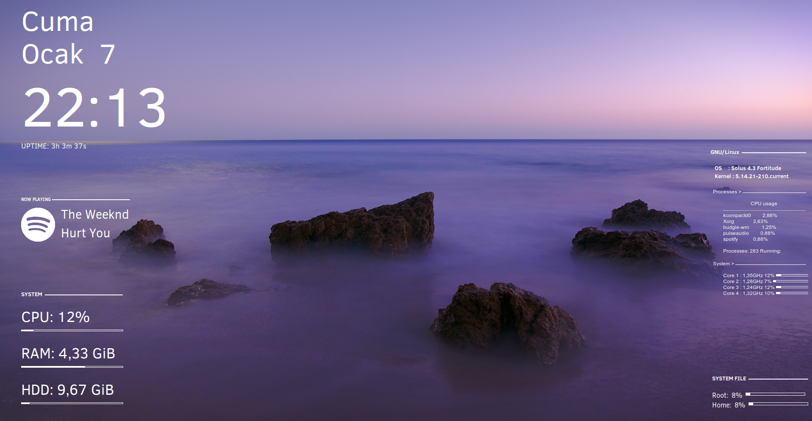
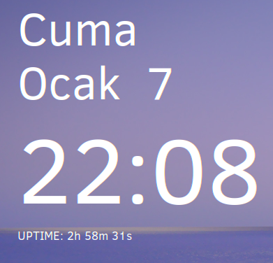
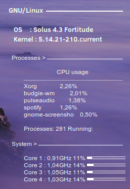
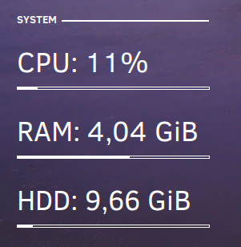
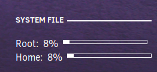

<h1 align="center">Conky Widgets</h1>
<p align="center">
  
  
  
</p>

<p align="center"><i>Made with :heart: by <a href="https://github.com/mhykoI">@mhykoI</a></i></p>

<p align="center">Conky Widgets your computer is set up to make the desktop look aesthetically pleasing and minimalistic.

<div align="center" style="display:inline">

</div>

### Table of contents

- [Requirements](#requirements)
  - [Packages](#packages)
- [Widgets](#widgets)
  - [Clock](#clock)
  - [Status](#status)
  - [System](#system)
  - [File](#file)
  - [Spotify](#spotify)
- [Installation](#installation)
- [FAQ](#faq)

## Requirements

### Packages

- [conky](https://github.com/brndnmtthws/conky/)

> Ubuntu: `sudo apt install conky`

> Arch: `sudo pacman -S conky`

## Widgets

### Clock
> Displays the system time and date


### Status
> Displays information about the system


### System
> Shows the storage that the system uses


### File
> Shows the disk space used


### Spotify
> Spotify shows the music being played


## Installation

1. Install all required [packages](#packages):
```bash
# Ubuntu
$ sudo apt install conky
# Arch
$ sudo pacman -S conky
```
2. Clone the repo:
```bash
$ git clone https://github.com/ByCh4n-Group/Conky-Widgets
```
3. Run the `start.sh` script to start the widget (forks to background):
```bash
$ path/to/Conky-Widgets/start.sh
```

## FAQ

> -Daha sonra burayı dolduracağım-
